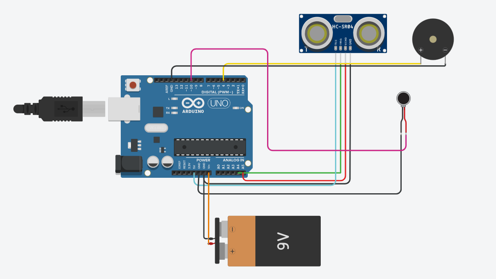

# Third Eye for the Blind

## Overview
The **Third Eye for the Blind** is a wearable assistive device designed to help visually impaired individuals navigate their surroundings safely. It uses an **Arduino UNO** with **ultrasonic sensors** to detect obstacles and provides feedback through a buzzer or vibration motor.

## Features
- **Obstacle Detection**: Uses ultrasonic sensors to detect objects.
- **Haptic & Audio Feedback**: Alerts the user with vibrations or sound.
- **Compact & Wearable**: Designed for ease of use.
- **Low Power Consumption**: Efficient and long-lasting.

## Components Used
- **Arduino UNO**
- **Ultrasonic Sensor (HC-SR04)**
- **Buzzer / Vibration Motor**
- **Battery Pack**
- **Wires & Connectors**

## Circuit Diagram

## Installation & Usage
1. **Upload Code**: Flash the `Third_eye.ino` file onto your Arduino using the Arduino IDE.
2. **Connect Components**: Assemble the circuit as per the diagram.
3. **Power On**: Use a battery pack to turn on the device.
4. **Start Using**: The device will alert you when an obstacle is detected.

## How It Works
- The **ultrasonic sensor** continuously measures the distance to nearby objects.
- If an obstacle is detected within a predefined range, the **buzzer or vibration motor** provides feedback.
- The system resets and continues scanning for obstacles.

## Future Improvements
- Adding **AI-based object recognition**.
- Implementing **Bluetooth connectivity** for remote alerts.
- Integrating **GPS for navigation assistance**.

## License
This project is open source and does not have a specific license. Feel free to modify and distribute it under your own terms.
